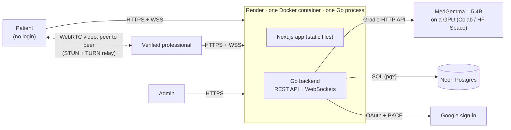

# SwasthyaSetu

*The bridge to health* · स्वास्थ्य सेतु · Built by team **Pookiedevs**.

First-aid guidance from an AI assistant, and a live video call with a
**verified** doctor, pharmacist, nurse, paramedic or MBBS student, for
communities where medical help is far away.

**The demo flow:**

1. **Emergency first.** The landing page leads with *Get first-aid help*,
   which opens the first-aid chat with no sign-up, and 102 is always in the
   header.
2. A patient describes what's happening, in **English or Nepali**. **MedGemma**
   replies with first-aid steps. Messages that sound like an emergency are
   flagged with *Call 102* and *Talk to a professional*.
3. The patient requests a doctor (still no login) and can share the chat, so
   they don't have to repeat themselves.
4. A **verified** medical professional, online on another laptop, is alerted,
   reads the chat, and accepts.
5. They talk on a live **WebRTC video call**, with mute, camera off, and hang
   up. The patient sees **"Verified Doctor · <name>"**. If there's no camera,
   the call continues as voice-only.

**Trust and accounts:**

- **Google sign-in.** Optional for patients (it keeps their chats under "My
  chats"); required for professionals.
- **Professional verification (KYC).** Doctors submit their Nepal Medical
  Council number, pharmacists their Nepal Pharmacy Council number, nurses
  their Nepal Nursing Council number, paramedics their Nepal Health
  Professional Council number, and MBBS students a doctor's letter of
  recommendation; everyone uploads their citizenship certificate. An admin
  reviews every application by hand. Only approved professionals can see
  waiting patients or take calls.
- **Help record.** Each professional sees "You've helped N people" and who:
  the patient's name, the date and the length of each finished call. Each
  professional sees only their own record.

## Architecture at a glance



One Go program serves the website, the API and the WebSockets from **one
address**, so there is no CORS to configure and no API URL built into the
frontend. The live queue and the call rooms live in its memory, so it runs as
exactly one process.

- **First aid.** The chat goes to the Go backend, which:
  - flags urgent words (English and Nepali) and shows the 102 banner;
  - answers plainly off-topic requests with a fixed sentence, without the
    model;
  - sends everything else to MedGemma with a short English or Nepali
    prompt;
  - cleans the reply (no "thinking", no planning, no diagnosis, no doses).
- **Talk to a professional.** The request joins an in-memory queue, pushed
  live over a WebSocket to verified professionals. A tone plays, the first
  to accept wins, and the server relays the WebRTC handshake. Audio and
  video then flow directly between the two browsers, or through a TURN
  relay.
- **Trust.** Google sign-in, documents checked by the admin, and the
  server-side `requireProfessional` check on every request. The patient
  sees "Verified Doctor · Dr. …".
- **Hosting.** Everything runs in the cloud: Render (app), Neon (database),
  Colab or a Hugging Face Space (GPU model), ExpressTURN (relay), Google
  (sign-in). GitHub Actions checks every push.

Full detail, with diagrams for the AI pipeline, the call sequence,
verification and hosting: **[docs/architecture.md](docs/architecture.md)**.

## The Go backend

**Everything the backend does is written in Go**: the API, the WebSockets,
the MedGemma client and its safety checks, Google sign-in, verification and
admin review, saved chats, the help record, serving the website, and the
end-to-end browser test. The full guide (every package, the API, settings,
how a request flows) is **[docs/go-backend.md](docs/go-backend.md)**.

```
backend/
├── cmd/
│   ├── server/        the backend program: settings → database → model → HTTP server
│   └── smoketest/     the whole demo in real Chrome windows (14 steps)
└── internal/
    ├── api/           the front door: every route, both WebSockets, the website,
    │                  and the server-side "verified only" check
    ├── ai/            MedGemma client + safety checks (urgent, off-topic, cleaning)
    ├── consult/       the waiting room: queue, atomic accept, end (in memory)
    ├── realtime/      WebSocket hub (live queue + call signalling), STUN/TURN
    ├── auth/          Google sign-in (OAuth + PKCE), session tokens
    ├── verify/        verification rules: what each profession submits, file checks
    ├── store/         every database query
    ├── database/      Postgres (Neon) or SQLite; creates the tables; retries
    ├── config/        settings from environment variables
    ├── ratelimit/     15 chat messages a minute per person
    └── logging/       structured logs
```

How the pieces work together:

- **A chat message:** browser → `api` → `ratelimit` → `ai` (safety checks,
  then MedGemma) → `store` saves it for signed-in patients → reply.
- **A call:** the request goes into `consult`; `realtime` pushes it live to
  verified professionals; accepting happens under a lock, so only one wins;
  then `realtime` relays the WebRTC handshake and the video goes browser to
  browser.

What makes it dependable:

- **Emergency first:** chat and "talk to a professional" never need a login,
  and keep working when the database is down.
- **Verified only, on the server:** the waiting list, accept, the queue
  socket and the help record all check the professional's approval.
- **Secure by default:** hashed session cookies, PKCE, same-site redirects,
  uploads typed from their bytes, no path escapes, origin-checked
  WebSockets, a non-root image with no shell.
- **Small:** one static binary, a 33 MB image, three runtime dependencies
  (`pgx`, a pure-Go SQLite, `coder/websocket`); everything else is Go's
  standard library.
- **Tested:** about 170 Go tests with the race detector, run on SQLite and on
  real Postgres, plus the 14-step browser test of the full demo.

## Stack

| Layer | Technology |
|---|---|
| Frontend | Next.js 16 (static export, installable PWA) · TypeScript · Tailwind CSS v4 · shadcn/ui · Zustand · StringTune (motion) |
| Backend | **Go 1.26** · standard-library HTTP server · `coder/websocket` · one process, one static binary |
| AI | MedGemma 1.5 4B (`google/medgemma-1.5-4b-it`) in a Gradio app on a GPU: Colab T4 or a Hugging Face Space |
| Data | Postgres (Neon) via `pgx`; SQLite (pure Go) for local development |
| Auth | Google OAuth 2.0 (authorization code + PKCE), HttpOnly session cookie stored hashed |
| Real-time | WebSockets (live queue + call signalling) · WebRTC with STUN and TURN (ExpressTURN or Cloudflare) |
| Testing | `go test -race` (SQLite + Postgres) · `cmd/smoketest` (Chrome, via chromedp) · ESLint · TypeScript |
| Hosting | One Docker image on Render (33 MB, no shell, non-root) · Neon · Colab or HF Spaces · GitHub Actions CI |

## Run it locally

```bash
# Backend (API on :8000), needs Go 1.26+
cd backend
cp .env.example .env              # set HF_SPACE_ID; DEV_LOGIN=true
go run ./cmd/server

# Frontend (on :3000), in a second terminal
cd frontend
cp .env.example .env.local
npm install
npm run dev
```

Open <http://localhost:3000>. Locally the database is a SQLite file, and
`DEV_LOGIN=true` adds a development sign-in (any email, no Google) so you can
be a patient, a professional, and the admin (an email in `ADMIN_EMAILS`) in
separate browser windows. Or run the production image with
`docker compose up --build` and open <http://localhost:8000>.

## Deploy and demo

- **[docs/deployment.md](docs/deployment.md)**: MedGemma (Colab) → TURN
  relay → Neon database → Google sign-in → Render → first admin and verified
  professional.
- **[docs/demo.md](docs/demo.md)**: the 5-minute script, pre-demo checklist,
  and what to do if something fails on stage.
- **Before every rehearsal:** `cd backend && go run ./cmd/smoketest <your-url>`
  runs the whole flow in real Chrome windows and reports each step. Locally
  it also covers applying, admin approval and saved chats.

## Checks

```bash
cd backend  && gofmt -l . && go vet ./... && go test -race ./...
cd frontend && npm run lint && npm run typecheck && npm run build
```

`make help` lists shortcuts (on Windows, run `make` from Git Bash). CI runs
these on every push, runs the backend tests again on Postgres, and builds
the Docker image and checks that it boots and serves the pages.

## Repository layout

| Path | Contents |
|---|---|
| [backend/](backend/) | The Go backend and the end-to-end test ([guide](docs/go-backend.md)) |
| [frontend/](frontend/) | Next.js app: chat, account, verification form, professional dashboard, admin review, video call |
| [model-space/](model-space/) | The MedGemma model server for the GPU (Colab or a Hugging Face Space). The only part not in Go or TypeScript: running the model needs PyTorch |
| [docs/](docs/) | [Go backend](docs/go-backend.md), [architecture](docs/architecture.md), [deployment](docs/deployment.md), [demo playbook](docs/demo.md), Phase III requirements |
| [Dockerfile](Dockerfile) · [render.yaml](render.yaml) | One image; one Render service |

## Important

SwasthyaSetu gives **first-aid information, not a medical diagnosis**. In an
emergency in Nepal, call **102**. This is a hackathon build: professional
verification is a manual document review, not a link to the Nepal Medical
Council or Pharmacy Council registers.

## Team

| Name | Responsibility |
|------|----------------|
| Aaditya Raj Uprety | Project Lead & Backend Development |
| Arekh Shrestha | Frontend Development (Mobile App) |
| Raksha Karn | AI/ML Engineer (Edge & Cloud Models) |
| Shreyam Regmi | Backend Integration |
| Smriti Adhikari | UI/UX Design & Frontend Website |
| Srijit Gyawali | Full Stack |
| Yojana Ghimire | AI/ML Engineer (Edge & Cloud Models) |
