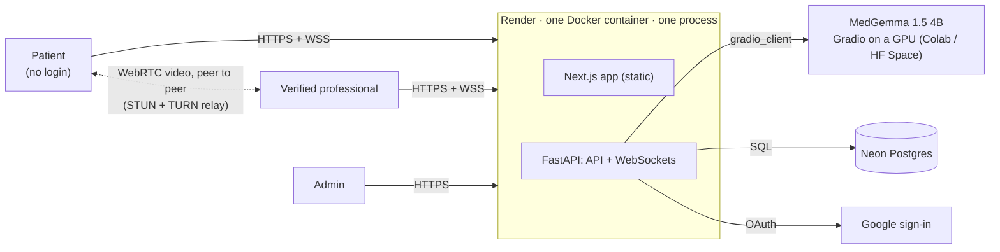

# SwasthyaSetu

*The bridge to health* · स्वास्थ्य सेतु · Built by team **Pookiedevs**.

First-aid guidance from an AI assistant, and a live video call with a
**verified** doctor, pharmacist, nurse, paramedic or MBBS student, for
communities where medical help is far away.

**The demo flow:**

1. **Emergency first.** The landing page leads with *Get first-aid help*,
   which opens the first-aid chat with no sign-up, and 102 is always in the
   header.
2. A patient describes what's happening, in **English or Nepali**. **MedGemma**
   replies with first-aid steps. Messages that sound like an emergency are
   flagged with *Call 102* and *Talk to a professional*.
3. The patient requests a doctor (still no login) and can share the chat, so
   they don't have to repeat themselves.
4. A **verified** medical professional, online on another laptop, is alerted,
   reads the chat, and accepts.
5. They talk on a live **WebRTC video call**, with mute, camera off, and hang
   up. The patient sees **"Verified Doctor · <name>"**. If there's no camera,
   the call continues as voice-only.

**Trust and accounts:**

- **Google sign-in.** Optional for patients (it keeps their chats under "My
  chats"); required for professionals.
- **Professional verification (KYC).** Doctors submit their Nepal Medical
  Council number, pharmacists their Nepal Pharmacy Council number, nurses
  their Nepal Nursing Council number, paramedics their Nepal Health
  Professional Council number, and MBBS students a doctor's letter of
  recommendation; everyone uploads their
  citizenship certificate. An admin reviews every application by hand. Only
  approved professionals can see waiting patients or take calls.
- **Help record.** Each professional sees "You've helped N people" and who:
  the patient's name, the date and the length of each finished call. Each
  professional sees only their own record.

## Architecture at a glance



- **First aid.** The chat goes to FastAPI, which:
  - flags urgent words and shows the 102 banner;
  - answers plainly off-topic requests with a fixed sentence;
  - sends everything else to MedGemma with a short English or Nepali
    prompt;
  - cleans the reply (no "thinking", no diagnosis, no doses).
- **Talk to a professional.** The request joins an in-memory queue, pushed
  live over a WebSocket to verified professionals. A tone plays, the first
  to accept wins, and the server relays the WebRTC handshake. Audio and
  video then flow directly between the two browsers, or through a TURN
  relay.
- **Trust.** Google sign-in, documents checked by the admin, and the
  server-side `require_professional` check on every request. The patient
  sees "Verified Doctor · Dr. …".
- **Hosting.** Everything runs in the cloud: Render (app), Neon (database),
  Colab or a Hugging Face Space (GPU model), ExpressTURN (relay), Google
  (sign-in). GitHub Actions checks every push.

Full detail, with diagrams for the AI pipeline, the call sequence,
verification and hosting: **[docs/architecture.md](docs/architecture.md)**.

## Stack

| Layer | Technology |
|---|---|
| Frontend | Next.js 16 (static export, installable PWA) · TypeScript · Tailwind CSS v4 · shadcn/ui · Zustand · StringTune (motion) |
| Backend | Python · FastAPI · Uvicorn, **one process** (serves the API, WebSockets and the frontend from one origin) |
| AI | MedGemma 1.5 4B (`google/medgemma-1.5-4b-it`, Transformers, bfloat16) in a Gradio app on a GPU: Colab T4 or a Hugging Face Space |
| Data | Postgres (Neon) via SQLModel and psycopg 3; SQLite for local development |
| Auth | Google OAuth 2.0 (authorization code + PKCE), HttpOnly session cookie stored hashed |
| Real-time | FastAPI WebSockets (live queue + call signalling) · WebRTC with STUN and TURN (ExpressTURN or Cloudflare) |
| Hosting | One Docker image on Render · Neon · Colab or HF Spaces · GitHub Actions CI |

## Run it locally

```bash
# Backend (API on :8000)
cd backend
python -m venv .venv
.venv/Scripts/pip install -r requirements-dev.txt     # macOS/Linux: .venv/bin/pip
cp .env.example .env                                  # set HF_SPACE_ID; DEV_LOGIN=true
.venv/Scripts/uvicorn app.main:app --reload

# Frontend (on :3000), in a second terminal
cd frontend
cp .env.example .env.local
npm install
npm run dev
```

Open <http://localhost:3000>. Locally the database is a SQLite file, and
`DEV_LOGIN=true` adds a development sign-in (any email, no Google) so you can
be a patient, a professional, and the admin (an email in `ADMIN_EMAILS`) in
separate browser windows. Or run the production image with
`docker compose up --build` and open <http://localhost:8000>.

## Deploy and demo

- **[docs/deployment.md](docs/deployment.md)**: MedGemma (Colab) → TURN
  relay → Neon database → Google sign-in → Render → first admin and verified
  professional. About an hour and a half the first time.
- **[docs/demo.md](docs/demo.md)**: the 5-minute script, pre-demo checklist,
  and what to do if something fails on stage.
- **Before every rehearsal:** `python scripts/smoke_test.py <your-url>` runs
  the whole flow in real Chrome windows and reports each step. Locally it
  also covers applying, admin approval and saved chats.

## Checks

```bash
cd backend  && .venv/Scripts/ruff check app tests ../model-space ../scripts && .venv/Scripts/pytest
cd frontend && npm run lint && npm run typecheck && npm run build
```

`make help` lists shortcuts (on Windows, run `make` from Git Bash). CI also
builds the Docker image and checks that it boots and serves the pages.

## Repository layout

| Path | Contents |
|---|---|
| [backend/](backend/) | FastAPI app: chat, consultations, WebSocket signalling, MedGemma client, sign-in, verification, saved chats |
| [frontend/](frontend/) | Next.js app: chat, account, verification form, professional dashboard, admin review, video call |
| [model-space/](model-space/) | The Hugging Face Space that serves MedGemma |
| [scripts/smoke_test.py](scripts/smoke_test.py) | Multi-browser end-to-end check of the demo |
| [docs/](docs/) | Architecture, deployment, demo playbook, Phase III requirements |
| [Dockerfile](Dockerfile) · [render.yaml](render.yaml) | One image; one Render service |

## Important

SwasthyaSetu gives **first-aid information, not a medical diagnosis**. In an
emergency in Nepal, call **102**. This is a hackathon build: professional
verification is a manual document review, not a link to the Nepal Medical
Council or Pharmacy Council registers.

## Team

| Name | Responsibility |
|------|----------------|
| Aaditya Raj Uprety | Project Lead & Backend Development |
| Arekh Shrestha | Frontend Development (Mobile App) |
| Raksha Karn | AI/ML Engineer (Edge & Cloud Models) |
| Shreyam Regmi | Backend Integration |
| Smriti Adhikari | UI/UX Design & Frontend Website |
| Srijit Gyawali | Full Stack |
| Yojana Ghimire | AI/ML Engineer (Edge & Cloud Models) |
