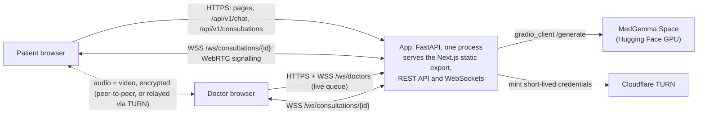

# Architecture

## Components

**Frontend**: `frontend/`. Next.js (TypeScript, Tailwind CSS, shadcn/ui,
Zustand) built as a **static export**. Three pages: `/` (role picker),
`/patient/` (chat → request a doctor → call) and `/doctor/` (go online →
queue → accept → call). Installable via the web app manifest.

**App server**: `backend/`. FastAPI, run as a single uvicorn process. It serves
the frontend export, the REST API, and the WebSockets from one origin. That
removes CORS and build-time API URLs, and keeps in-memory state in one place.

| Module | Role |
|---|---|
| `api/chat.py` | `POST /api/v1/chat`: validates, rate-limits, trims history, calls the model |
| `ai/medgemma.py` | Client for the Space, with a timeout and a clean "unavailable" error; reconnects after failures |
| `ai/prompts.py` | System prompt (bilingual, first-aid only, no doses, 102 for emergencies) and a keyword emergency check |
| `api/consultations.py` | Request a doctor / accept / end. Returns a **call ticket**: a room token plus ICE servers |
| `services/consultations.py` | In-memory registry. Atomic accept, so two doctors can't both take one patient |
| `realtime/websocket.py` | Doctor queue push and per-call signalling relay |
| `realtime/ice.py` | STUN + TURN config: Cloudflare-minted credentials or static ones |

**Model**: `model-space/`. A Gradio Space that loads
`google/medgemma-1.5-4b-it` in bfloat16 and exposes one `/generate` API. It
runs on dedicated GPU hardware or ZeroGPU.

## Call flow

1. The patient requests a doctor and gets a ticket: a consultation id, a
   **patient token**, and ICE servers. The doctor queue updates live.
2. A doctor accepts and gets a **doctor token**. Accept is atomic, so a second
   doctor gets a 409.
3. Both open `/ws/consultations/{id}?token=…`. The token decides the role.
   Only these two tokens exist, so nobody else can join.
4. **Offer rule:** whoever is already in the room when the other arrives
   receives `peer-joined` and makes the WebRTC offer. Only one side gets that
   event, so both can never offer at once. The same rule rebuilds the call
   after either side refreshes: the page keeps the ticket in sessionStorage
   and rejoins, and the server replaces the stale socket.
5. Offer, answer, and ICE candidates relay through the server. Candidates
   that arrive early are buffered. Media then flows peer-to-peer, or through
   TURN when there's no direct path.
6. Either side ends the call. The other side is told, and the consultation is
   marked ended so its tokens stop working.

**Self-healing.** Calls recover from the failures that happen on real
networks and devices, each verified by fault injection:

| Failure | Recovery |
|---|---|
| A signalling message is lost, or ICE stalls | A watchdog rejoins after 20 s without connecting; the other side re-offers. Up to 2 automatic retries, then a Reconnect button. |
| The connection drops to `failed` | Immediate automatic rejoin (same retry budget) |
| The camera dies mid-call (unplugged, taken by another app, privacy switch) | The camera is re-acquired and hot-swapped with `replaceTrack`, with no renegotiation. If that fails, the call continues voice-only. |
| A page refresh, or a server WebSocket drop | The ticket is kept in sessionStorage; the page rejoins and the server replaces the stale socket |

## Deliberate limits (demo scope)

- **In-memory state, single process.** A restart clears the queue and active
  calls. Chat history is safe: it lives in the patient's browser tab and is
  sent with each message.
- **No accounts.** Anyone can open `/doctor/` and accept. Room tokens still
  stop a third person joining a call. Real use needs doctor accounts and
  verification first.
- **The emergency check is keywords, not triage.** It only makes sure the
  "call 102 / talk to a doctor" banner never waits on the model.
- **Not a diagnosis.** The model gives first-aid information. The prompt
  forbids medicine doses and routes anything serious to 102 and a doctor.
- **Public chat endpoint.** It is rate-limited per client (15 per minute)
  because every message spends GPU time.

## Requirements coverage

The full Phase III requirements are in
[`SwasthyaSetu-Phase3-Requirements.pdf`](SwasthyaSetu-Phase3-Requirements.pdf).
This build delivers the demo slice of them: AI symptom guidance (English and
Nepali), doctor queueing and matching (first available doctor), and live
video and voice consultation. Still to build: phone OTP accounts, doctor
credential review, the facility locator, the offline first-aid library, the
Nepali voice interface (whisper.cpp and TTS), consultation history, consent
management, and notifications.
