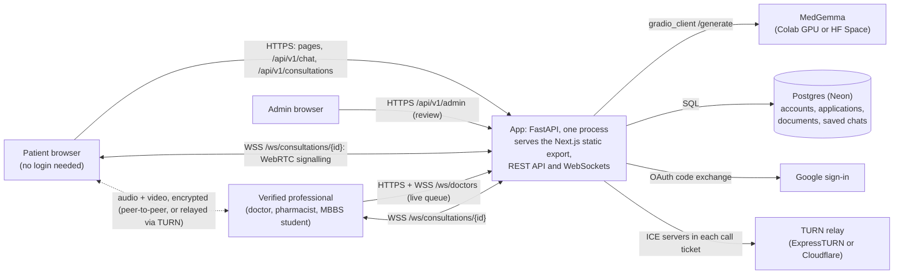

# Architecture

```mermaid
flowchart LR
    P["Patient browser<br/>(no login needed)"] -- "HTTPS: pages, /api/v1/chat, /api/v1/consultations" --> A
    D["Verified professional<br/>(doctor, pharmacist, MBBS student)"] -- "HTTPS + WSS /ws/doctors (live queue)" --> A
    R["Admin browser"] -- "HTTPS /api/v1/admin (review)" --> A
    P <-- "WSS /ws/consultations/{id}: WebRTC signalling" --> A
    D <-- "WSS /ws/consultations/{id}" --> A
    A["App: FastAPI, one process<br/>serves the Next.js static export,<br/>REST API and WebSockets"] -- "gradio_client /generate" --> M["MedGemma<br/>(Colab GPU or HF Space)"]
    A -- "SQL" --> DB[("Postgres (Neon)<br/>accounts, applications,<br/>documents, saved chats")]
    A -- "OAuth code exchange" --> G["Google sign-in"]
    A -- "ICE servers in each call ticket" --> T["TURN relay<br/>(ExpressTURN or Cloudflare)"]
    P <-. "audio + video, encrypted (peer-to-peer, or relayed via TURN)" .-> D
```

## Components

**Frontend**: `frontend/`. Next.js (TypeScript, Tailwind CSS, shadcn/ui,
Zustand) built as a **static export**. Installable via the web app manifest.

| Page | Who | What |
|---|---|---|
| `/` | Everyone | Landing page: what SwasthyaSetu is and who answers, in English or नेपाली. **Get first-aid help** opens the chat; 102 is in the hero and the header. No login. |
| `/patient/` | Everyone | **Emergency first**: the first-aid chat, 102 button, "Talk to a professional". No login. Signed-in patients also get "My chats". |
| `/account/` | Everyone | Sign in with Google, choose a role (Patient, Doctor, Pharmacist, MBBS Student), sign out |
| `/apply/` | Professionals | Verification form: identity, council number or recommendation, document photos |
| `/doctor/` | Verified professionals | Go online → live queue → accept → call. Others see where their application stands |
| `/admin/` | The admin | Review applications and documents; approve, reject with reason, revoke |

**App server**: `backend/`. FastAPI, run as a single uvicorn process. It serves
the frontend export, the REST API, and the WebSockets from one origin. That
removes CORS and build-time API URLs, and keeps in-memory state in one place.

| Module | Role |
|---|---|
| `api/chat.py` | `POST /api/v1/chat`: validates, rate-limits, trims history, calls the model |
| `ai/medgemma.py` | Client for the Space, with a timeout and a clean "unavailable" error; reconnects after failures |
| `ai/prompts.py` | System prompt (bilingual, first-aid only, no doses, 102 for emergencies) and a keyword emergency check |
| `api/consultations.py` | Request a doctor / accept / end. Returns a **call ticket**: a room token plus ICE servers |
| `services/consultations.py` | In-memory registry. Atomic accept, so two doctors can't both take one patient |
| `realtime/websocket.py` | Doctor queue push and per-call signalling relay |
| `realtime/ice.py` | STUN + TURN config: Cloudflare-minted credentials or static ones |
| `api/auth.py`, `services/auth.py` | Google sign-in (authorization code + PKCE), session cookies, role choice, development login (local only) |
| `api/deps.py` | Who is asking: signed-in user, admin, verified professional (HTTP and WebSocket) |
| `api/applications.py`, `services/verification.py`, `services/documents.py` | Professional verification: submit/resubmit, document checks, the "verified" rule |
| `api/admin.py` | Review queue, admin-only document access, approve / reject / revoke, audit trail |
| `api/chats.py`, `services/chats.py` | Saved chats for signed-in patients |
| `db.py`, `models.py` | Postgres (SQLite locally) via SQLModel; startup never fails on the database |

**Model**: `model-space/`. A Gradio Space that loads
`google/medgemma-1.5-4b-it` in bfloat16 and exposes one `/generate` API. It
runs on dedicated GPU hardware or ZeroGPU.

## Accounts and verification

**Sign-in** is Google OAuth 2.0 (authorization code + PKCE), done by the
backend. The callback checks a state cookie (so a login can't be started in
one browser and finished in another), exchanges the code with the client
secret, checks the ID token's issuer, audience, expiry and verified email,
and sets an HttpOnly, SameSite=Lax session cookie. Only a SHA-256 hash of
the session token is stored. Sign-in is **optional for patients**; nothing on
the emergency path asks for it.

**Roles.** After the first sign-in a user picks Patient, Doctor, Pharmacist
or MBBS Student. Admin is not a role: it is granted to the Google accounts in
`ADMIN_EMAILS`, and the admin skips role selection.

**Verification (KYC).** A professional submits:

| Role | Identity (all) | Registration |
|---|---|---|
| Doctor | Citizenship number + district, photos of both sides; optional selfie holding it | Nepal Medical Council (NMC) number + certificate |
| Pharmacist | same | Nepal Pharmacy Council number + certificate |
| MBBS student | same | Medical college, recommending doctor's name and NMC number, letter of recommendation |

File types are detected from the bytes (JPEG, PNG, WebP, PDF), never from
the name; photos are shrunk on the phone before upload. Documents are stored
in Postgres and readable only by the admin. The admin approves, or rejects
with a reason the applicant sees; a rejected applicant fixes and resubmits
the same application. Every step is in the audit log.

A user is a **verified professional** only while their application is
approved *and* their role matches it. The server checks this on every
request to the waiting list, on accept, and when the queue WebSocket opens.
Verified pharmacists and MBBS students take calls exactly like doctors, and
the patient always sees who accepted ("Verified Doctor · Dr. …").

**Saved chats.** For a signed-in patient each successful reply is stored with
the messages that led to it; a conversation started as a guest is saved on
sign-in. Chats are only ever visible to their owner. Signing out clears the
open conversation from the device.

## Call flow

1. The patient requests a doctor and gets a ticket: a consultation id, a
   **patient token**, and ICE servers. The doctor queue updates live.
2. A verified professional accepts and gets a **doctor token**. Accept is
   atomic, so a second one gets a 409. Their verified name and role are
   attached to the consultation for the patient's badge.
3. Both open `/ws/consultations/{id}?token=…`. The token decides the role.
   Only these two tokens exist, so nobody else can join.
4. **Offer rule:** whoever is already in the room when the other arrives
   receives `peer-joined` and makes the WebRTC offer. Only one side gets that
   event, so both can never offer at once. The same rule rebuilds the call
   after either side refreshes: the page keeps the ticket in sessionStorage
   and rejoins, and the server replaces the stale socket.
5. Offer, answer, and ICE candidates relay through the server. Candidates
   that arrive early are buffered. Media then flows peer-to-peer, or through
   TURN when there's no direct path.
6. Either side ends the call. The other side is told, and the consultation is
   marked ended so its tokens stop working.

**Self-healing.** Calls recover from the failures that happen on real
networks and devices, each verified by fault injection:

| Failure | Recovery |
|---|---|
| A signalling message is lost, or ICE stalls | A watchdog rejoins after 20 s without connecting; the other side re-offers. Up to 2 automatic retries, then a Reconnect button. |
| The connection drops to `failed` | Immediate automatic rejoin (same retry budget) |
| The camera dies mid-call (unplugged, taken by another app, privacy switch) | The camera is re-acquired and hot-swapped with `replaceTrack`, with no renegotiation. If that fails, the call continues voice-only. |
| A page refresh, or a server WebSocket drop | The ticket is kept in sessionStorage; the page rejoins and the server replaces the stale socket |

## Deliberate limits (demo scope)

- **Single process.** The waiting queue and active calls are in memory, so a
  restart clears them. Accounts, applications and saved chats are in
  Postgres and survive. A guest's chat lives in their browser tab.
- **Verification is manual.** There is no API to the Nepal Medical Council or
  Pharmacy Council registers, or to citizenship records, so the admin checks
  documents and numbers by hand. Citizenship numbers are district-issued, so
  they are stored with the district.
- **One admin, configured by email.** No admin management UI.
- **Documents in the database.** Fine for a few hundred applicants on the
  free tier; move them to object storage before that.
- **Tables are created at startup** (`create_all`), with no migrations yet.
- **The emergency check is keywords, not triage.** It only makes sure the
  "call 102 / talk to a doctor" banner never waits on the model.
- **Not a diagnosis.** The model gives first-aid information. The prompt
  forbids medicine doses and routes anything serious to 102 and a doctor.
- **Public chat endpoint.** It is rate-limited per client (15 per minute)
  because every message spends GPU time.

## Requirements coverage

The full Phase III requirements are in
[`SwasthyaSetu-Phase3-Requirements.pdf`](SwasthyaSetu-Phase3-Requirements.pdf).
This build delivers the demo slice of them: AI symptom guidance (English and
Nepali), doctor queueing and matching (first available doctor), and live
video and voice consultation, accounts (Google sign-in), medical
professional verification with manual review, and saved chat history. Still
to build: phone OTP sign-in, the facility locator, the offline first-aid
library, the Nepali voice interface (whisper.cpp and TTS), consultation
history for professionals, consent management, and notifications.
