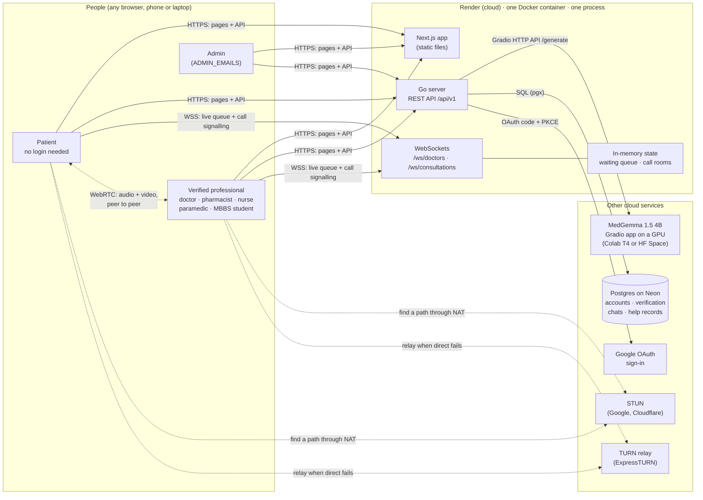
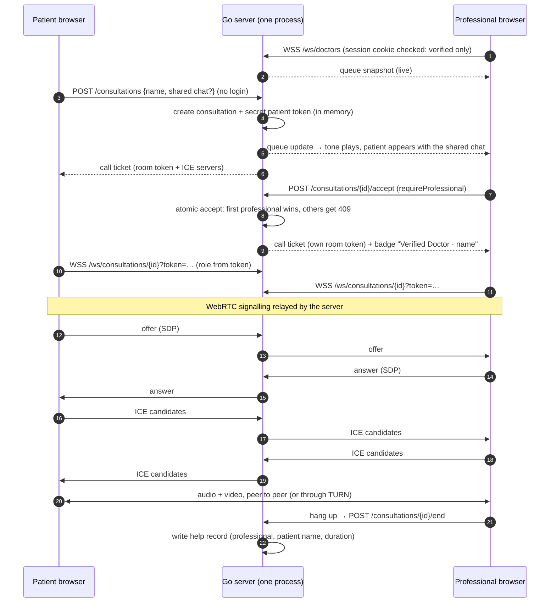
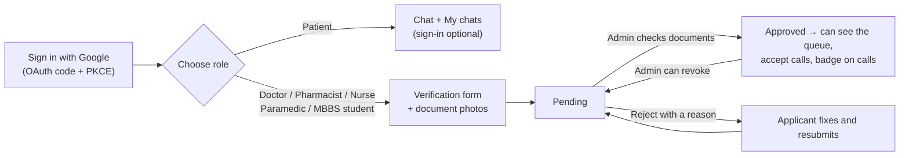
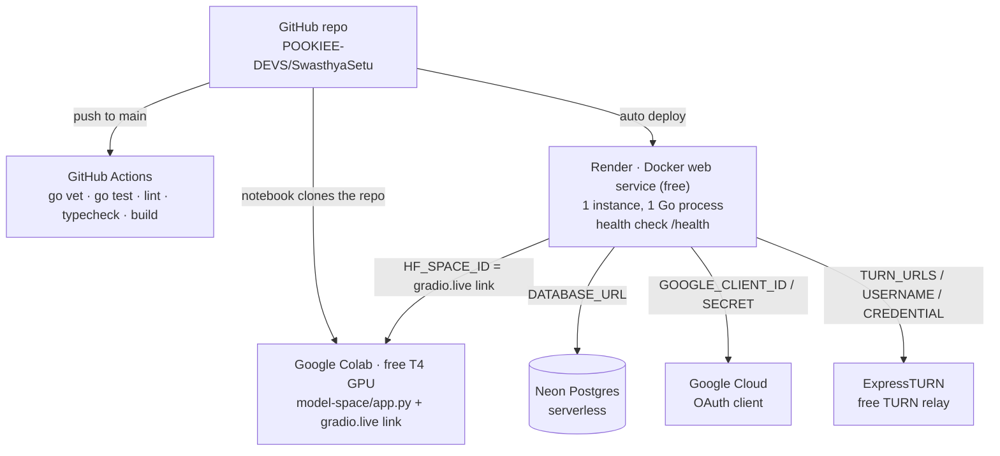

# SwasthyaSetu architecture

SwasthyaSetu ("bridge to health") takes someone from "I don't know what to do"
to a verified professional on video:

1. **First aid now.** A patient describes what happened, in English or
   नेपाली, and MedGemma (Google's medical AI model) answers with short
   first-aid steps. No account needed.
2. **A verified professional next.** The patient taps *Talk to a
   professional*. A verified doctor, pharmacist, nurse, paramedic or MBBS
   student hears a tone, accepts, and they talk on a live video call. The
   patient sees "Verified Doctor · Dr. …".

Around that journey: Google sign-in, document-based verification of every
professional, one admin who reviews them, saved chats, and a help record for
each professional.

---

## 1. The big picture

```mermaid
flowchart LR
    subgraph Users["People (any browser, phone or laptop)"]
        P["Patient<br/>no login needed"]
        D["Verified professional<br/>doctor · pharmacist · nurse<br/>paramedic · MBBS student"]
        AD["Admin<br/>(ADMIN_EMAILS)"]
    end

    subgraph Render["Render (cloud) · one Docker container · one process"]
        FE["Next.js app<br/>(static files)"]
        API["Go server<br/>REST API /api/v1"]
        WS["WebSockets<br/>/ws/doctors · /ws/consultations"]
        MEM["In-memory state<br/>waiting queue · call rooms"]
    end

    subgraph Cloud["Other cloud services"]
        LLM["MedGemma 1.5 4B<br/>Gradio app on a GPU<br/>(Colab T4 or HF Space)"]
        DB[("Postgres on Neon<br/>accounts · verification<br/>chats · help records")]
        G["Google OAuth<br/>sign-in"]
        TURN["TURN relay<br/>(ExpressTURN)"]
        STUN["STUN<br/>(Google, Cloudflare)"]
    end

    P & D & AD -- "HTTPS: pages + API" --> FE & API
    P & D -- "WSS: live queue + call signalling" --> WS
    API -- "Gradio HTTP API /generate" --> LLM
    API -- "SQL (pgx)" --> DB
    API -- "OAuth code + PKCE" --> G
    WS --- MEM
    P <-. "WebRTC: audio + video,<br/>peer to peer" .-> D
    P & D -. "find a path through NAT" .-> STUN
    P & D -. "relay when direct fails" .-> TURN
```

The one rule behind the shape: **everything the app serves comes from one
origin, out of one process.** The website, the API and the WebSockets share
an address, so there is no CORS to configure and no API address to build into
the frontend. The live queue and call rooms live in that process's memory, so
it must run as exactly one process (one instance).

---

## 2. Components

| Component | Technology | What it does |
|---|---|---|
| **Frontend** | Next.js 16 (TypeScript, Tailwind CSS v4, shadcn/ui, Zustand), built as a **static export** | Every page: landing, first-aid chat, request form, video call, professional dashboard, verification form, admin review. Bilingual (English / नेपाली). Installable as a PWA |
| **Backend** | **Go** (standard-library HTTP server, `coder/websocket`), **one process**, one static binary | REST API, WebSocket signalling, serves the built frontend, talks to the model, the database and Google |
| **AI model** | `google/medgemma-1.5-4b-it` with Hugging Face Transformers, wrapped in a **Gradio** app (`model-space/app.py`) | Generates first-aid replies. Runs on a GPU: free Colab T4 (public `gradio.live` link) or a paid Hugging Face GPU Space |
| **Database** | Postgres on **Neon** (serverless), via `pgx`. SQLite locally (pure-Go driver) | Users, sessions, verification applications and documents, audit log, saved chats, help records |
| **Sign-in** | Google OAuth 2.0 (authorization code + PKCE), done by the backend | Patients optional, professionals required. HttpOnly session cookie |
| **Video** | **WebRTC** in the browser, signalling over our WebSocket, STUN plus a **TURN** relay | Two-way audio and video, peer to peer |
| **Hosting** | **Render** (Docker, free plan), Neon, Colab or HF Spaces, ExpressTURN | All cloud; nothing runs on our laptops during the demo |
| **CI** | GitHub Actions | Backend `gofmt`, `go vet`, `staticcheck`, `go test -race` (on SQLite and on Postgres); frontend lint + typecheck + build; the Docker image boots |

### Backend packages (`backend/`, Go)

Requests come in through `internal/api`, which uses the other packages.
Only `internal/store` writes SQL, and only `internal/api` speaks HTTP.

| Package | Responsibility |
|---|---|
| `cmd/server` | The entry point: reads the settings, opens the database (never fatal), starts the HTTP server; graceful shutdown; `server -healthcheck` for the container |
| `cmd/smoketest` | The end-to-end test: the whole demo in real Chrome windows (14 steps) |
| `internal/config` | All settings from environment variables (Render dashboard or `backend/.env`) |
| `internal/api` | Every route: chat, saved chats, consultations and help record, sign-in, verification, admin review, `/health`; the two WebSockets; the static frontend; request ids, logs, CORS. Holds the server-side checks `currentUser`, `requireAdmin` and **`requireProfessional`** ("verified only") |
| `internal/ai` | System prompts (English and Nepali), history trimming, urgent and off-topic checks, cleaning the model's output, and the client for the Gradio model app (timeout, reconnect, one fallback retry) |
| `internal/consult` | In-memory registry: request a professional, accept (atomic, under a lock), end |
| `internal/realtime` | The WebSocket hub (live queue and call rooms, one writer per socket, pings) and the STUN/TURN servers each call gets |
| `internal/auth` | Google OAuth with PKCE, session tokens (only their hash is stored) |
| `internal/verify` | What each profession must submit, and document type checks from the file's bytes |
| `internal/store` | Every SQL query: accounts, sessions, applications, documents, audit log, saved chats, help records |
| `internal/database` | Postgres or SQLite behind one API; creates the tables at startup and retries while the database is down |
| `internal/ratelimit` | 15 chat messages a minute per client |
| `internal/logging` | Structured logs: readable lines locally, JSON with `LOG_JSON=true` |

### Frontend pages (`frontend/app/`)

| Route | Who | What |
|---|---|---|
| `/` | Everyone | Landing page: what SwasthyaSetu is, *Get first-aid help*, 102 always in view, English / नेपाली switch |
| `/patient/` | Everyone | The first-aid chat, *Talk to a professional*, the request form and the video call. No login |
| `/account/` | Everyone | Sign in with Google, choose a role, sign out |
| `/apply/` | Professionals | Verification form with document photos |
| `/doctor/` | Verified professionals | Go online, live queue with a tone, accept, video call, help record |
| `/admin/` | Admin | Review applications and documents; approve, reject, revoke |

---

## 3. The AI: from a message to first-aid steps

```mermaid
sequenceDiagram
    autonumber
    participant B as Patient's browser
    participant API as Go server /api/v1/chat
    participant M as Gradio app (GPU)
    participant LLM as MedGemma 1.5 4B

    B->>API: last messages (history, up to 2000 chars each)
    API->>API: rate limit (15 per minute per IP)
    API->>API: urgent keywords? (chest pain, बेहोस, ...) → urgent = true
    alt plainly off-topic (code, homework, poems...) and no health words
        API-->>B: fixed sentence: "I can only help with health and first-aid questions..."
    else health question
        API->>API: build prompt: short system prompt (English, or written in Nepali<br/>for a Nepali message) + last 8 turns, patient's words unchanged
        API->>M: POST /gradio_api/call/generate, read the result (timeout 120 s)
        M->>M: Gemma chat template, fit to 3000 input tokens
        M->>LLM: generate (greedy, max 400 new tokens), thinking switched off
        LLM-->>M: reply
        M-->>API: reply text
        API->>API: clean it: drop any "thinking", drop a planning preamble
        opt reply is the model's own analysis ("The user has asked... Plan:")
            API->>M: retry once with the simple fallback prompt
        end
        API-->>B: { reply, urgent, chat_id }
    end
    B->>B: show reply; if urgent: red banner "Call 102 / Talk to a professional"
```

How the pieces work and why:

- **Model.** `google/medgemma-1.5-4b-it` is Google's open medical variant of
  Gemma 3 (4 billion parameters). It is a gated model on Hugging Face: you
  accept its terms, and the GPU host uses an `HF_TOKEN`. It runs with
  Transformers in bfloat16 on one GPU (a free Colab T4 is enough).
- **Serving.** `model-space/app.py` is a small Gradio app with one API
  endpoint, `/generate`. It takes the conversation as JSON and returns the
  reply. On Colab, `GRADIO_SHARE=1` prints a public `https://….gradio.live`
  link, and that link goes in Render as `HF_SPACE_ID`. On a Hugging Face
  Space the Space name goes there instead. It runs one generation at a time
  (a queue), since one GPU can't usefully run two at once.
- **Thinking switched off.** MedGemma 1.5 can "think" before answering,
  inside special markers (`<unused94>…<unused95>`). The app starts the
  answer with an empty thought and bans the thought token, so the model
  answers straight away. Any thinking that does appear is removed by its
  markers before anything is shown.
- **Prompts.** These are short plain sentences, not a rules list. A rules
  list made the 4B model analyse the instructions out loud. A Nepali message
  gets the instruction written in Nepali, so it answers in Nepali. Rules
  baked in: numbered first-aid steps under 180 words, **no diagnosis, never
  medicine doses**, 102 first for anything life-threatening, health
  questions only.
- **Guard rails around the model:**
  - *Urgent check*: a keyword list in English and Nepali flags emergencies
    (chest pain, unconsciousness, heavy bleeding…) and shows the red 102
    banner. 102 is also in the header of every page, never behind the AI or
    a login.
  - *Off-topic check*: plainly non-health requests (code, homework, poems,
    "ignore your rules") get a fixed sentence without calling the model.
    Anything that also mentions a symptom or an emergency always goes to the
    model.
  - *Output cleaning*: thinking and planning preambles are removed. A reply
    that is the model's own analysis is retried once with a simpler prompt,
    and never shown.
  - *Limits*: 15 messages a minute per IP, a 2000-character message limit,
    the last 8 turns of history, and a 120-second timeout with a clear "the
    model is waking up, try again" message.
- **Privacy.** The chat goes only to our own model, never to a third-party
  chatbot API. It is saved only for signed-in patients ("My chats"), and is
  shared with a professional only if the patient ticks *share my chat*.

---

## 4. Talk to a professional: queue, accept and video call

```mermaid
sequenceDiagram
    autonumber
    participant P as Patient browser
    participant S as Go server (one process)
    participant D as Professional browser

    D->>S: WSS /ws/doctors (session cookie checked: verified only)
    S-->>D: queue snapshot (live)
    P->>S: POST /consultations {name, shared chat?} (no login)
    S->>S: create consultation + secret patient token (in memory)
    S-->>D: queue update → tone plays, patient appears with the shared chat
    S-->>P: call ticket (room token + ICE servers)
    D->>S: POST /consultations/{id}/accept (requireProfessional)
    S->>S: atomic accept: first professional wins, others get 409
    S-->>D: call ticket (own room token) + badge "Verified Doctor · name"
    P->>S: WSS /ws/consultations/{id}?token=… (role from token)
    D->>S: WSS /ws/consultations/{id}?token=…
    Note over P,D: WebRTC signalling relayed by the server
    P->>S: offer (SDP)
    S->>D: offer
    D->>S: answer (SDP)
    S->>P: answer
    P->>S: ICE candidates
    S->>D: ICE candidates
    D->>S: ICE candidates
    S->>P: ICE candidates
    P<<->>D: audio + video, peer to peer (or through TURN)
    D->>S: hang up → POST /consultations/{id}/end
    S->>S: write help record (professional, patient name, duration)
```

- **Queue.** Waiting patients live in an in-memory registry. Verified
  professionals hold a WebSocket open to `/ws/doctors`. Every change is
  pushed to them at once, and the browser plays a tone for a new patient.
- **Accept is atomic.** Every change to the registry happens under one lock,
  so two professionals pressing *Accept* together can't both win.
- **Live updates in order.** Each WebSocket has its own writer and queue, so
  a slow browser never holds up the others, and a professional never gets an
  older queue after a newer one.
- **Room tokens.** Each participant gets a random secret token for the
  call's WebSocket. The token decides the role (patient or professional),
  and a third person can't join. Tokens are never in the queue data.
- **WebRTC.** Media goes **directly between the two browsers**, encrypted
  (DTLS/SRTP). The server only relays the handshake: the offer and answer
  (SDP) and the ICE candidates.
- **STUN and TURN.** STUN (Google's and Cloudflare's) lets each browser
  learn its public address. On networks that block direct connections
  (mobile data, strict routers) a **TURN relay** forwards the media.
  ExpressTURN gives free static credentials. Cloudflare TURN is also
  supported, with short-lived credentials made per call.
- **Resilience.**
  - Camera or mic missing or blocked: the call falls back to voice-only
    after 10 seconds.
  - A refresh in the middle of a call rejoins it, because the ticket is kept
    in the browser.
  - A dropped peer gets "waiting for them to rejoin".
  - The call has mute, camera off and hang up.
- **Trust on the call.** The patient sees "Verified Doctor · Dr. …" (or
  Pharmacist, Nurse, Paramedic, MBBS Student). The badge comes from the
  server: the name the admin checked against the citizenship certificate.

---

## 5. Accounts, verification and trust

```mermaid
flowchart LR
    A["Sign in with Google<br/>(OAuth code + PKCE)"] --> R{"Choose role"}
    R -->|Patient| PT["Chat + My chats<br/>(sign-in optional)"]
    R -->|"Doctor / Pharmacist / Nurse<br/>Paramedic / MBBS student"| AP["Verification form<br/>+ document photos"]
    AP --> PEND["Pending"]
    PEND -->|"Admin checks documents"| OK["Approved → can see the queue,<br/>accept calls, badge on calls"]
    PEND -->|"Reject with a reason"| FIX["Applicant fixes and resubmits"]
    FIX --> PEND
    OK -->|"Admin can revoke"| PEND
```

- **Sign-in.** The backend runs Google OAuth itself (authorization code with
  PKCE and a state cookie). It then sets an **HttpOnly, SameSite=Lax**
  session cookie. The database stores only a **SHA-256 hash** of the cookie,
  so a database leak doesn't hand out working sessions. Admins are the
  Google accounts listed in `ADMIN_EMAILS`, not a role anyone can choose.
- **What each professional submits.** Everyone gives their citizenship
  number and district, and photos of both sides of the certificate (a
  selfie holding it is optional). Then:

  | Role | Registration |
  |---|---|
  | Doctor | Nepal Medical Council (NMC) number + certificate |
  | Pharmacist | Nepal Pharmacy Council number + certificate |
  | Nurse | Nepal Nursing Council number + certificate |
  | Paramedic | Nepal Health Professional Council number + certificate |
  | MBBS student | Medical college, a recommending doctor's name and NMC number, and their letter |

- **Documents.** File types are detected from the bytes (JPEG, PNG, WebP,
  PDF), never from the name. Photos are shrunk on the phone before upload,
  up to 5 MB each. They are stored in Postgres, only the admin can view
  them, and every submission, approval and rejection goes in an audit log.
- **Enforced on the server.** `requireProfessional` runs on every
  request to the waiting list and on accept. The queue WebSocket checks the
  session too and closes with code 4401 if the user isn't verified. Hiding
  a button is never the only guard.
- **Help record.** When an accepted call ends, one row goes into the
  database: the professional, the patient's name, when, and how long. It is
  counted once, even though both sides report the end. Each professional
  sees only their own record.
- **Saved chats.** Signed-in patients' chats are stored after each
  successful reply and visible only to their owner. A chat started as a
  guest is saved on sign-in.

### Database tables

| Table | Holds |
|---|---|
| `users` | Google account id, email, name, picture, role |
| `sessions` | SHA-256 hash of each session cookie, expiry |
| `applications` | One verification application per user: identity, council number or recommendation, status, rejection reason |
| `documents` | Uploaded documents (bytes, detected type, size) |
| `audit_events` | Who submitted, approved or rejected, when and why |
| `chats`, `chat_messages` | Saved conversations of signed-in patients |
| `help_records` | Each completed call: professional, patient name, time, duration |

Tables are created at startup. If the database is down, the app still
starts and retries every 30 seconds: chat, 102 and calls keep working, while
sign-in, verification and history wait for it.

---

## 6. Hosting: all in the cloud

```mermaid
flowchart TB
    GH["GitHub repo<br/>POOKIEE-DEVS/SwasthyaSetu"] -->|"push to main"| CI["GitHub Actions<br/>go vet · go test · lint · typecheck · build"]
    GH -->|"auto deploy"| RB["Render · Docker web service (free)<br/>1 instance, 1 Go process<br/>health check /health"]
    GH -->|"notebook clones the repo"| CO["Google Colab · free T4 GPU<br/>model-space/app.py + gradio.live link"]
    RB -->|"HF_SPACE_ID = gradio.live link"| CO
    RB -->|"DATABASE_URL"| NE[("Neon Postgres<br/>serverless")]
    RB -->|"GOOGLE_CLIENT_ID / SECRET"| GO["Google Cloud<br/>OAuth client"]
    RB -->|"TURN_URLS / USERNAME / CREDENTIAL"| ET["ExpressTURN<br/>free TURN relay"]
```

- **One Docker image** (`Dockerfile`, multi-stage). Stage 1 builds the
  Next.js static export with Node. Stage 2 builds the Go backend into one
  static binary. Stage 3 runs that binary on a minimal base image (no shell,
  non-root user, 33 MB in all), serving the built `out/` folder.
  `render.yaml` describes the service (Docker runtime, free plan, `/health`
  check) and lists its environment variables.
- **Secrets never live in the repo.** `HF_TOKEN`, `DATABASE_URL`, the
  Google client secret and the TURN credentials are set in the Render
  dashboard (or a gitignored `backend/.env` locally). `HF_TOKEN` is also a
  Colab secret.
- **The model host**, either:
  - Colab (free): `model-space/colab.ipynb` clones the repo, logs in to
    Hugging Face, loads MedGemma on the T4 and prints the public link. It
    must stay open during the demo, and the link changes on each run, so the
    new link goes in `HF_SPACE_ID`.
  - A Hugging Face GPU Space (paid): the same `app.py`, with a stable name.
- **`/health`** reports the version, uptime, whether the model, TURN,
  database and Google sign-in are configured, and whether the database is
  reachable.
- **Free-plan caveat:** Render's free web service sleeps when idle and wakes
  on the first request (about a minute). Open the site before the demo.

---

## 7. Safety by design

- **Emergency first:** 102 is in every header and in the hero, and the
  urgent banner offers *Call 102* and *Talk to a professional*. None of it
  needs the AI, a login or the database.
- **First-aid information, not diagnosis:** the prompts forbid diagnosis
  and medicine doses, and say "may suggest", not "you have".
- **Only verified people see patients**, enforced on the server.
- **Consent:** the chat is shared with a professional only when the patient
  ticks the box; saved chats are private to their owner.
- **Honest limits:**
  - The urgent banner arrives together with the AI's reply, not before it.
  - Verification is a manual document check, not yet linked to the
    councils' public registers.
  - Calls need a data connection.
  - Queue and calls are in memory, so a server restart ends calls in
    progress.

---

## 8. Quality checks

- **Backend:** `gofmt`, `go vet`, `staticcheck` and `go test -race` (166
  tests, run on SQLite and again on Postgres). They cover chat, prompts and
  cleaning, off-topic and urgent detection, the model client,
  consultations and atomic accept, WebSocket signalling with real sockets,
  verification checks, sign-in and sessions, admin review, saved chats and
  help records. A guide to every package: [go-backend.md](go-backend.md).
- **Frontend:** ESLint, TypeScript and a production build.
- **End to end:** `go run ./cmd/smoketest <url>` (in `backend/`) runs the whole demo in real
  Chrome windows (14 steps), with fake camera and mic:
  1. A professional applies with documents, the admin approves, and the
     professional goes online.
  2. The patient chats in English, then sends an urgent message in Nepali.
  3. The patient requests a professional, who sees them with the shared
     chat.
  4. Two-way video, the "Verified Doctor" badge, mute and camera off, and
     rejoining after a refresh.
  5. Hang up, then the help record counts the call.
  6. The patient signs in and finds the chat in *My chats*.
