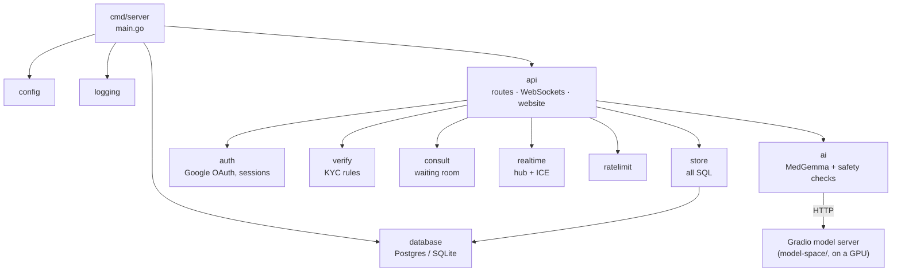

# The Go backend

SwasthyaSetu's backend is written in **Go**. It is one program, built into
one static binary, that serves everything from one address:

- `/api/v1/*`: the REST API (chat, consultations, sign-in, verification,
  admin, saved chats, help records);
- `/ws/*`: the WebSockets (the professionals' live queue and the call
  signalling);
- `/`: the website (the built Next.js frontend).

One address means no CORS and no API URL to build into the frontend. It runs
as **exactly one process**: the waiting queue and the call rooms live in its
memory, so a second copy would split them and calls would not connect.

This page explains how the backend is organised, what each part does, and
how to run, test and deploy it. For the whole system (frontend, model, video
calls, hosting), see [architecture.md](architecture.md).

---

## 1. Folder layout

```
backend/
├── go.mod, go.sum          the module and its dependencies
├── .env.example            every setting, documented (copy to .env)
├── cmd/
│   ├── server/             the backend program (main.go)
│   └── smoketest/          the end-to-end browser test (Go + Chrome)
└── internal/               the backend's packages, one job each
    ├── api/                HTTP: every route, the WebSockets, the website
    ├── ai/                 MedGemma client and the chat's safety checks
    ├── auth/               Google sign-in (OAuth + PKCE), session tokens
    ├── config/             settings from environment variables
    ├── consult/            the waiting room: the in-memory consultation queue
    ├── database/           Postgres or SQLite connection, the tables
    ├── logging/            structured logs
    ├── ratelimit/          15 chat messages a minute per person
    ├── realtime/           WebSocket hub (queue + call rooms), STUN/TURN
    ├── store/              every database query
    ├── testdb/             a fresh database for each test
    └── verify/             verification rules: what each profession submits
```

`internal/` means these packages can only be used by this backend. Each
package has its tests next to its code, in `*_test.go` files.

### Who uses whom



Two rules keep it simple: **only `internal/api` speaks HTTP**, and **only
`internal/store` writes SQL**. Everything else is plain Go that the tests
can call directly.

---

## 2. What each part does

### `cmd/server` — the program

`main.go` reads the settings, sets up logging, opens the database, creates
the MedGemma client and starts the HTTP server on `$PORT` (default 8000).

- **The database never blocks startup.** If it can't be reached, the server
  starts anyway: chat, 102 and patient calls don't need it.
- **Graceful shutdown.** On `SIGTERM` (a Render redeploy) it stops taking
  requests, tells every WebSocket to reconnect, and finishes what is in
  flight.
- **`server -healthcheck`** checks `/health` and exits 0 or 1. The Docker
  image has no shell or curl, so the binary checks itself.

### `internal/config` — settings

Reads every setting from environment variables, or from `backend/.env` when
it exists (real environment variables win). Invalid values stop startup
with a message naming the variable, instead of being silently ignored.
See [Settings](#6-settings) below.

### `internal/api` — the front door

Every URL lives here. One file per area:

| File | What it handles |
|---|---|
| `server.go` | The route table, `/health`, the Server struct that holds everything |
| `chat.go` | `POST /api/v1/chat` and the saved chats ("My chats") |
| `consultations.go` | Request a professional, the waiting list, accept, end, the help record |
| `signin.go` | `/auth/me`, Google login and callback, logout, choosing a role, development login |
| `applications.go` | The verification form (multipart upload, streamed, never written to disk) |
| `admin.go` | Admin review: list, view documents, approve, reject, revoke |
| `ws.go` | The two WebSockets: `/ws/doctors` and `/ws/consultations/{id}` |
| `session.go` | Who is asking: `currentUser`, `requireAdmin`, **`requireProfessional`** |
| `static.go` | Serves the built website, safely (no `../` escapes) |
| `middleware.go` | Request ids, request logs, panic recovery, CORS, client IP |
| `respond.go` | JSON responses and errors as `{"detail": "..."}` |
| `views.go` | The JSON shapes the frontend reads |

**`requireProfessional`** is the "verified only" rule, checked on the server
for every request to the waiting list, accept, and the help record: the
account's application must be approved, and its role must match. The queue
WebSocket checks the same thing before it sends anything.

### `internal/ai` — MedGemma and the safety checks

- **`prompts.go`**: the system prompts (English, and the same instruction
  written in Nepali for a Nepali message), and the checks around the model:
  - *urgent*: emergency words in English and Nepali (chest pain, बेहोस,
    heavy bleeding, ...) raise the red 102 banner;
  - *off-topic*: plainly non-health requests (code, homework, poems,
    "ignore your rules") get a fixed answer without calling the model;
  - *cleaning*: the model's "thinking" and planning paragraphs are removed;
    a reply that is the model's own analysis is recognised and never shown.
- **`gradio.go`**: a small client for Gradio's HTTP API. It sends the
  conversation to the model server's `/generate` endpoint and reads the
  result stream. It accepts a Hugging Face Space id or any URL (such as a
  Colab `gradio.live` link), looks the server up once, and looks it up again
  after a failure. The Hugging Face token is only ever sent to Hugging Face.
- **`medgemma.go`**: one call with a timeout (120 s by default) and clear
  messages for the patient ("not configured", "took too long", "unavailable").
  `Answer()` retries once with a simpler prompt if the reply is analysis.

### `internal/consult` — the waiting room

The queue of patients and the calls in progress, in memory. Every change
happens under one lock, so **two professionals pressing Accept at once can't
both win** (tested with 50 at once). Each participant gets a secret room
token; a call is counted once in the help record when it ends.

### `internal/realtime` — live connections

- **Hub** (`hub.go`): rooms for the live queue and for each call. Every
  socket has its own writer and queue, so a slow phone never holds up
  anyone else, and messages arrive in order. It relays the WebRTC handshake
  (offer, answer, ICE candidates, hang-up) between the two participants.
  A page refresh replaces the old socket (close code 4000) and the call
  resumes. A ping every 20 s keeps connections alive through proxies.
- **ICE** (`ice.go`): the STUN and TURN servers each call gets: static
  credentials (ExpressTURN), or short-lived Cloudflare credentials, with a
  fallback if Cloudflare fails.

### `internal/auth` — sign-in

Google OAuth with the authorization code and PKCE. A random state, kept in
memory for 10 minutes and in a short cookie, ties Google's answer to the
browser that asked. The ID token's issuer, audience, expiry and verified
email are checked. The session cookie is HttpOnly and SameSite=Lax, and the
database stores only its SHA-256 hash.

### `internal/verify` — verification rules (KYC)

What each profession submits: council number and certificate for doctors,
pharmacists, nurses and paramedics; college and a doctor's recommendation
for MBBS students; both sides of the citizenship certificate for everyone.
A file's type is decided from its first bytes (JPEG, PNG, WebP, PDF), never
from its name, so a disguised file is refused.

### `internal/store` and `internal/database` — data

- `database` opens **Postgres** (production, Neon) through `pgx`, or
  **SQLite** (local development and tests) through a pure-Go driver. It
  creates the eight tables at startup (`schema.go`, `IF NOT EXISTS`), and if
  the database is down it retries at most every 30 seconds. Postgres
  connections are pooler-safe (Neon's `-pooler` host) and checked before
  reuse.
- `store` holds every query: users and sessions, applications with their
  documents and audit log, saved chats, help records. Times are stored in
  UTC and sent to the browser as Unix seconds.

### `internal/ratelimit`, `internal/logging`

15 chat messages a minute per client address (memory stays bounded however
many people visit). Logs are readable lines locally and JSON in production
with `LOG_JSON=true`; every API request is logged with its status and time.

### `cmd/smoketest` — the whole demo in real browsers

Opens Chrome three times (a professional, the admin, a patient) with a fake
camera and microphone, and walks the demo: apply → approve → chat in English
and Nepali → request → accept → two-way video → badge → mute → refresh
mid-call → hang up → help record → saved chats. It prints `PASS`/`FAIL` for
each of the 14 steps, and what each screen showed if one fails.

---

## 3. How a request flows

**A chat message**

```mermaid
sequenceDiagram
    participant B as Browser
    participant A as api/chat.go
    participant M as ai
    participant G as Model server (GPU)
    participant S as store
    B->>A: POST /api/v1/chat
    A->>A: rate limit, check the message
    A->>M: urgent? off-topic?
    alt off-topic
        M-->>A: fixed answer (model not called)
    else health question
        M->>G: /generate (timeout 120 s)
        G-->>M: reply
        M->>M: remove thinking; retry once if it is analysis
    end
    A->>S: save it (signed-in patients only; never fails the reply)
    A-->>B: { reply, urgent, chat_id }
```

**A video call**

1. The patient sends `POST /api/v1/consultations` (no login). `consult`
   adds them to the queue; `realtime` pushes the new queue to every online
   verified professional, whose browser plays a tone.
2. A professional sends `POST /consultations/{id}/accept`.
   `requireProfessional` checks them; `consult` gives the call to the first
   one, under its lock. Both sides get a ticket: a room token plus the
   STUN/TURN servers.
3. Both browsers open `/ws/consultations/{id}?token=...`. The hub relays the
   WebRTC offer, answer and ICE candidates. The video then flows directly
   between the two browsers, or through the TURN relay.
4. Hanging up sends `POST /consultations/{id}/end`, which writes the help
   record once.

---

## 4. The API

| Method and path | Who | What |
|---|---|---|
| `GET /health` (also `/api/v1/health`) | anyone | Status, version, what is configured, whether the database is reachable |
| `POST /api/v1/chat` | anyone | One chat turn: `{messages, chat_id}` → `{reply, urgent, chat_id}` |
| `GET /api/v1/chats` | signed in | The user's saved chats |
| `POST /api/v1/chats` | signed in | Save a chat started before signing in |
| `GET /api/v1/chats/{id}` | owner | Open a saved chat |
| `DELETE /api/v1/chats/{id}` | owner | Delete a saved chat |
| `POST /api/v1/consultations` | anyone | Request a professional (no login) |
| `GET /api/v1/consultations` | verified professional | The waiting list |
| `GET /api/v1/consultations/helped` | verified professional | "You've helped N people" and who |
| `POST /api/v1/consultations/{id}/accept` | verified professional | Take the call (first one wins) |
| `POST /api/v1/consultations/{id}/end` | a participant (token) | Hang up |
| `GET /api/v1/auth/me` | anyone | Who is signed in |
| `GET /api/v1/auth/google/login` | anyone | Start Google sign-in |
| `GET /api/v1/auth/google/callback` | Google | Finish Google sign-in |
| `POST /api/v1/auth/logout` | anyone | Sign out |
| `POST /api/v1/auth/role` | signed in | Choose patient or a professional role |
| `POST /api/v1/auth/dev-login` | local only | Sign in without Google (`DEV_LOGIN=true`, never in production) |
| `GET /api/v1/applications/me` | signed in | The user's verification application |
| `POST /api/v1/applications` | signed in | Apply, with documents (multipart form) |
| `GET /api/v1/admin/applications?status=` | admin | Applications to review |
| `GET /api/v1/admin/documents/{id}` | admin | View a document |
| `POST /api/v1/admin/applications/{id}/approve` | admin | Approve |
| `POST /api/v1/admin/applications/{id}/reject` | admin | Reject (or revoke) with a reason |
| `GET /ws/doctors` | verified professional | Live queue (WebSocket) |
| `GET /ws/consultations/{id}?token=` | a participant | Call signalling (WebSocket) |

Errors are JSON `{"detail": "..."}` with a sentence the page shows as it
is. WebSocket close codes: 4401 not verified, 4403 unknown or ended call,
4000 replaced by a newer connection.

---

## 5. Run, test, build

Needs Go 1.26 or newer.

```bash
cd backend
cp .env.example .env          # set HF_SPACE_ID; DEV_LOGIN=true for local sign-in
go run ./cmd/server           # http://localhost:8000
```

To serve the website from the same server, build the frontend first
(`cd frontend && npm run build`) and set `STATIC_DIR=../frontend/out`.

**Checks** (CI runs the same on every push):

```bash
cd backend
gofmt -l .                    # prints nothing when the code is formatted
go vet ./...
go test -race ./...           # all tests, on SQLite
TEST_DATABASE_URL=postgres://user:pw@host/db go test ./internal/store/ ./internal/api/   # again on Postgres
```

The tests start a real server on a local port with a real database and a
fake model, and talk to it like a browser does, WebSockets included.

**The whole demo in real browsers** (needs Chrome installed). Run the server
with `DEV_LOGIN=true ADMIN_EMAILS=admin@smoke.test`, then:

```bash
go run ./cmd/smoketest http://localhost:8000
go run ./cmd/smoketest https://your-app.onrender.com --pro-session <cookie>   # the deployed site
```

**Docker** (what Render runs):

```bash
docker build -t swasthyasetu .   # from the repository root
docker run -p 8000:8000 swasthyasetu
```

The image is built in three stages: Node builds the website, Go builds one
static binary, and the final image holds only those two on a minimal base
with no shell, running as a non-root user (about 33 MB).

---

## 6. Settings

Set them in the Render dashboard, or in `backend/.env` locally.
`backend/.env.example` documents each one.

| Variable | Default | What it does |
|---|---|---|
| `HF_SPACE_ID` | (none) | The model server: a Space id `user/space` or a URL such as a `gradio.live` link |
| `HF_TOKEN` | (none) | Hugging Face token, for a private Space only |
| `MODEL_TIMEOUT_SECONDS` | 120 | How long to wait for the model |
| `DATABASE_URL` | `sqlite:///./swasthyasetu.db` | Postgres (`postgresql://...`) in production |
| `GOOGLE_CLIENT_ID`, `GOOGLE_CLIENT_SECRET` | (none) | Google sign-in |
| `ADMIN_EMAILS` | (none) | Comma-separated admin accounts |
| `PUBLIC_URL` | `RENDER_EXTERNAL_URL` | The site's address, for Google's redirect |
| `TURN_URLS`, `TURN_USERNAME`, `TURN_CREDENTIAL` | (none) | A TURN relay with static credentials (ExpressTURN) |
| `CLOUDFLARE_TURN_KEY_ID`, `CLOUDFLARE_TURN_API_TOKEN` | (none) | Or Cloudflare TURN |
| `STUN_URLS` | Google + Cloudflare | STUN servers |
| `DEV_LOGIN` | false | Sign in without Google (always off in production) |
| `ENVIRONMENT` | development | `production` in the Docker image |
| `PORT` | 8000 | Port to listen on |
| `STATIC_DIR` | `static` | Folder of the built website |
| `CORS_ORIGINS` | `http://localhost:3000` | Only for `npm run dev` on another port |
| `LOG_LEVEL`, `LOG_JSON` | INFO, false | Logging |
| `CHAT_RATE_LIMIT_PER_MINUTE` | 15 | Chat messages per minute per person |
| `CHAT_MAX_HISTORY_MESSAGES`, `CHAT_MAX_MESSAGE_CHARS` | 8, 2000 | History sent to the model; message length |
| `CONSULTATION_TTL_MINUTES` | 60 | When old requests leave memory |
| `SESSION_DAYS` | 30 | How long a sign-in lasts |
| `MAX_UPLOAD_BYTES` | 5 MiB | Largest document upload |

---

## 7. Built to be relied on

- **Emergency first.** Chat and "talk to a professional" never need a
  login, and keep working when the database is down. A signed-in patient
  still gets their answer if saving the chat fails.
- **Verified only, on the server.** The waiting list, accept, the queue
  socket and the help record all check the professional's approval.
- **Security.** Session cookies stored hashed; Google sign-in with PKCE and a
  state cookie; same-site redirects only; uploads typed from their bytes;
  the website served without path escapes; WebSockets accepted only from
  the site's own pages; the Hugging Face token sent only to Hugging Face; a
  non-root image with no shell.
- **Reliability.** Timeouts on every outside call; a reconnecting model
  client; database retries; ordered live updates; graceful shutdown; a
  container health check.
- **Tests.** About 170 Go tests (with the race detector), run on SQLite and
  on Postgres, plus the 14-step browser test of the full demo.

## 8. Dependencies

| Module | Why |
|---|---|
| `github.com/jackc/pgx/v5` | Postgres driver |
| `modernc.org/sqlite` | SQLite in pure Go (no C compiler needed) |
| `github.com/coder/websocket` | WebSockets |
| `github.com/chromedp/chromedp` | Drives Chrome, for `cmd/smoketest` only (not in the server binary) |

Everything else (HTTP server, routing, JSON, logging, crypto) is Go's
standard library.

## 9. What is not Go

- **The frontend** (`frontend/`): Next.js and TypeScript, built to static
  files that this backend serves.
- **The model server** (`model-space/`): runs MedGemma on a GPU (Google
  Colab or a Hugging Face Space). It needs PyTorch and Transformers, which
  only exist for Python, so it stays a small Python program. It is not part
  of the deployed backend; the Go code talks to it over HTTP.
